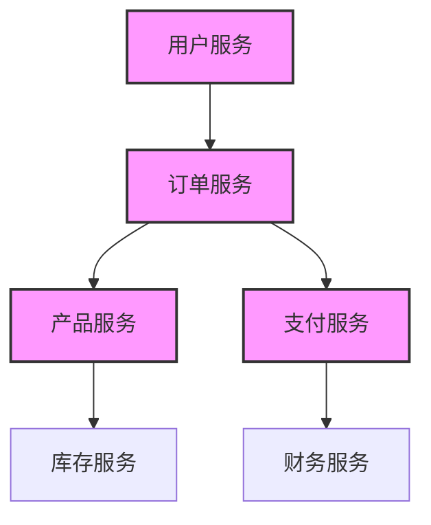

skill: "架构分析技能"
description: "大型单体应用的架构分析、领域边界识别和服务分解技术"
location: "plugin"
---

## 架构分析技能

### 核心能力

#### 1. 架构模式识别
- **分层架构分析**：识别控制器、服务、仓储层的职责边界
- **领域驱动设计**：识别聚合根、实体、值对象的边界
- **微服务模式**：识别服务候选者和拆分点
- **事件驱动架构**：识别事件流和消息队列模式

#### 2. 依赖关系分析
- **循环依赖检测**：识别模块间的循环引用
- **强耦合识别**：识别紧耦合的组件
- **层次结构分析**：分析系统各层的依赖关系
- **跨层依赖分析**：识别不合理的跨层调用

#### 3. 业务领域映射
- **能力划分**：按业务能力划分模块
- **数据所有权**：识别数据归属和业务边界
- **事务边界**：识别事务处理范围
- **API契约**：定义服务间接口契约

### 分析方法

#### 代码结构分析
```bash
# 目录结构分析
find . -type d -name "controller" -o -name "service" -o -name "repository"
find . -type d -name "domain" -o -name "entity" -o -name "dto"

# 依赖关系分析
grep -r "import.*Service" src/ --include="*.java"
grep -r "Autowired\|Inject" src/ --include="*.java"
```

#### 业务能力识别
```markdown
## 业务能力矩阵

### 核心能力
- 用户管理：注册、登录、权限
- 订单处理：创建、支付、发货
- 产品管理：目录、库存、价格
- 支付处理：支付、结算、退款

### 支撑能力
- 通知系统：邮件、短信、推送
- 报表系统：统计、分析、导出
- 日志系统：记录、查询、分析
- 配置管理：参数、开关、规则
```

#### 服务边界识别
```markdown
## 服务边界识别原则

### 高内聚原则
- 相关功能聚集在同一服务内
- 业务逻辑和数据封装在一起
- 单一职责，避免职责扩散

### 低耦合原则
- 服务间通过API交互
- 避免共享数据库
- 减少直接依赖关系

### 有界上下文
- 清晰的业务边界
- 独立的数据模型
- 独立的团队所有权
```

### 输出产物

#### 架构分析报告
```markdown
# 架构分析报告

## 现状分析
### 当前架构模式
- **主要模式**: [分层架构/领域驱动/其他]
- **耦合程度**: [高/中/低]
- **内聚程度**: [高/中/低]
- **可扩展性**: [好/中/差]

### 关键问题
- **架构问题**: [问题描述]
- **技术债务**: [债务分析]
- **性能瓶颈**: [瓶颈分析]
- **维护难点**: [难点分析]

## 服务分解建议
### 优先级排序
1. **高优先级服务**
   - 服务名称: [名称]
   - 业务价值: [价值描述]
   - 技术可行性: [可行性分析]
   - 迁移复杂度: [复杂度评估]

2. **中优先级服务**
   - 服务名称: [名称]
   - 业务价值: [价值描述]
   - 技术可行性: [可行性分析]
   - 迁移复杂度: [复杂度评估]

### 服务边界定义
- **用户服务**: [职责范围]
- **订单服务**: [职责范围]
- **产品服务**: [职责范围]
- **支付服务**: [职责范围]
```

#### 依赖关系图


### 最佳实践

#### 架构评估标准
- **可维护性**: 代码结构清晰，易于理解和修改
- **可扩展性**: 能够快速添加新功能，支持业务增长
- **可测试性**: 单元测试和集成测试覆盖率高
- **性能**: 满足性能要求，响应时间达标

#### 常见反模式
- **上帝对象**: 包含过多职责的大型类
- **贫血模型**: 只有数据没有业务逻辑的对象
- **跨层调用**: 直接访问其他层的实现细节
- **共享数据**: 多个服务共享同一数据库

#### 治理建议
- **代码规范**: 统一的编码标准和架构原则
- **设计审查**: 架构设计和重要变更的评审
- **技术债务**: 定期清理技术债务，防止累积
- **文档维护**: 保持架构文档的更新和维护

### 使用场景

#### 何时使用此技能
1. **项目初期**: 了解项目整体架构
2. **重构前**: 识别重构机会和风险
3. **微服务化**: 制定微服务拆分策略
4. **技术选型**: 评估技术架构合理性

#### 技能优势
- **系统性**: 提供完整的架构分析框架
- **实用性**: 提供具体的改进建议
- **可操作性**: 提供分步实施指南
- **前瞻性**: 考虑长期发展需求